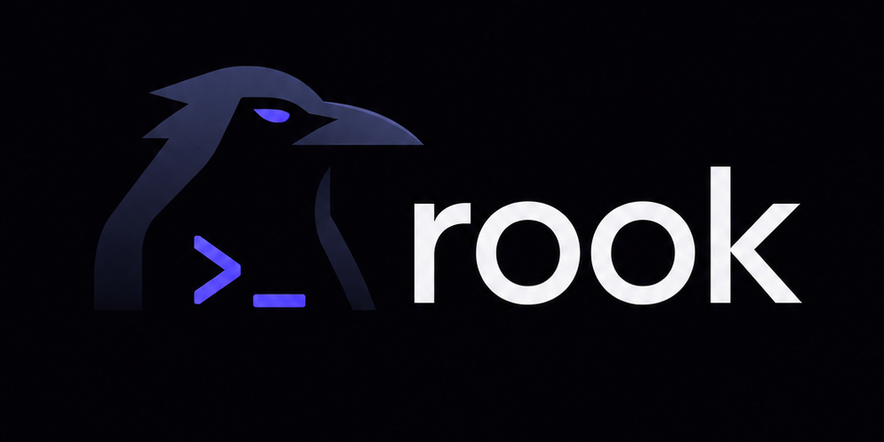
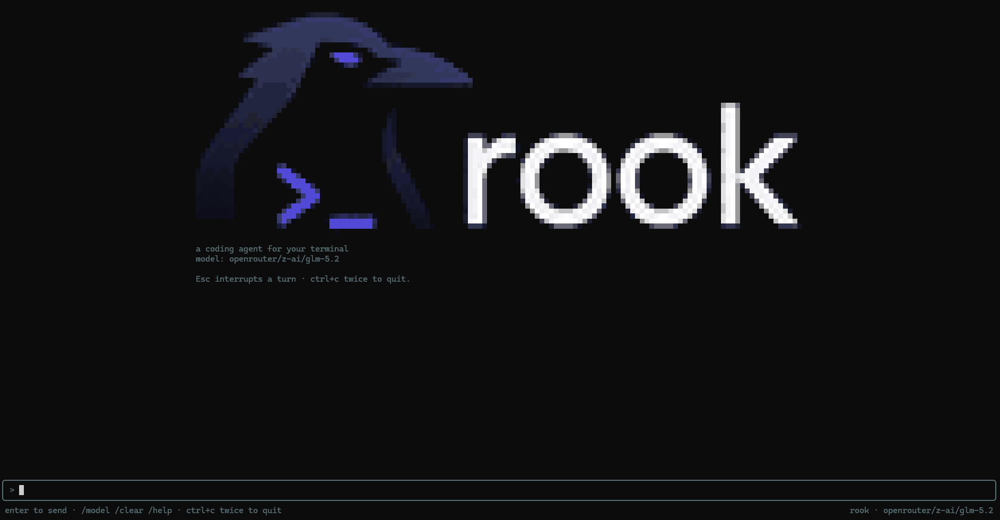

<div align="center">



### A coding agent that lives in your terminal

<p>
  <a href="https://github.com/martian56/rook/actions/workflows/ci.yml"></a>
  <a href="https://github.com/martian56/rook/releases/latest"></a>
  <a href="LICENSE"></a>
  <a href="https://github.com/martian56/raven"></a>
  
</p>

</div>

rook streams a real model's reply token by token, and the model can read,
search, edit files, and run commands in your working directory, with you
approving anything that changes the repo. It is built on the
[plumage](https://github.com/martian56/plumage) TUI framework and the
[aviary](https://github.com/martian56/aviary) model gateway, so it speaks to
OpenAI, Anthropic, Gemini, and a dozen more providers behind one API.

The name: a rook is the raven's cousin, which is what this is to the Raven
language.

**Contents:**
[Install](#install) · [Run it](#run-it) · [Talking to it](#talking-to-it) · [Models](#choosing-a-model) · [Tools](#tools) · [Commands](#commands) · [Skills & memory](#skills-and-memory) · [Subagents](#subagents) · [Web](#web) · [Git](#git) · [Plugins](#plugins) · [Hooks](#hooks) · [MCP](#mcp) · [How it is built](#how-it-is-built) · [Development](#development)

## Install

Download a build for your platform from the
[latest release](https://github.com/martian56/rook/releases/latest):

| Platform | File |
|----------|------|
| Windows | `rook-<version>-x86_64.msi` (adds rook to your PATH) or `rook-<version>-x86_64.zip` |
| Debian / Ubuntu | `rook_<version>_amd64.deb` |
| Fedora / RHEL | `rook-<version>-1.x86_64.rpm` |
| Linux (any) | `rook-<version>-x86_64.tar.gz` |

Or run it from source with the [Raven toolchain](https://github.com/martian56/raven):

```
git clone https://github.com/martian56/rook
cd rook
rvpm run
```

## Run it

Launch it in a real terminal, `rook` if you installed a release, or
`rvpm run` from a source checkout, then give it an API key. Either export
one:

```
export OPENROUTER_API_KEY=...     # or OPENAI_API_KEY, ANTHROPIC_API_KEY, ...
```

or type **`/key`** in the app and paste the key for the current provider. A
key entered that way is saved to `~/.rook/auth.json` and reused next time.
OpenRouter is the default provider, since one key there reaches most models.

<div align="center">

</div>

## Talking to it

- Type a message and press Enter. The reply streams in.
- Type `@` to pin a file to the message: a picker fuzzy-matches paths as
  you type, arrows move, Tab or Enter completes. On send, every
  `@path` you referenced is read and attached, so the model has those
  files without a separate read step.
- The model uses tools as it works. Reading and searching happen
  automatically; a file write, edit, or shell command pauses for your
  approval: **y** to allow, **a** to allow every call of that kind for the
  rest of the turn, **n** to deny (the denial is fed back to the model).
  A file change shows its diff right in the approval prompt, removals
  red, additions green, and again under the tool row once it runs, so
  you see exactly what changed.
- **Esc** interrupts; **ctrl+c** twice quits. **PageUp/PageDown** or the
  mouse wheel scroll.
- **Drag with the left mouse button** to select transcript text; it is
  copied to your clipboard on release. You can scroll while dragging, and
  dragging past the top or bottom edge extends the selection. (rook draws
  its own selection because it captures the mouse for scrolling; a click
  or any keypress clears it.)
- The status bar shows the session's token usage and an estimated cost;
  each turn also reports its own tokens and cost when it finishes. Costs
  are rough per-model estimates for at-a-glance spend, not billing.

## Choosing a model

Models are `provider/model` strings (aviary's format).

- `/model` opens a picker with a search bar: type to filter the
  complete OpenRouter model snapshot plus a smaller set of direct-provider
  choices, arrow-select and Enter. Your choice is remembered for next time.
- `/model anthropic/claude-sonnet-5` sets one directly; any
  `provider/model` string aviary can route works, listed or not.
- The startup model is resolved in order: the `--model` flag
  (`rvpm run -- --model openai/gpt-4o`), `ROOK_MODEL`, a project
  `rook.json`, a global `~/.config/rook/rook.json`, the last model you
  picked, then a built-in default.

`rook.json` is a small JSON file:

```json
{ "model": "openai/gpt-4o", "base_url": "" }
```

`base_url` (or `ROOK_BASE_URL`) points at any OpenAI-compatible endpoint,
for a local or self-hosted model.

The provider's key comes from its environment variable
(`OPENROUTER_API_KEY`, `OPENAI_API_KEY`, `ANTHROPIC_API_KEY`, and so on), or
from a key you entered with `/key` (stored in `~/.rook/auth.json`). Picking a
model whose provider has no key opens the key prompt automatically.

## Tools

The model can call:

- `read_file`, `list_dir`, `file_tree`, `grep` (read-only, run
  automatically)
- `write_file`, `edit_file`, `multi_edit`, `run_command`,
  `run_background` (mutating, approved by you)

`multi_edit` applies several find-and-replace edits to one file in a
single call, in order and all or nothing: if any `old_text` is missing,
nothing is written. A multi-spot change is one approval, and the prompt
shows the combined diff before you allow it.

File paths accepted by tools and `@` mentions are normalized inside the
workspace. Absolute paths, paths that escape with `..`, and symlinked path
segments are rejected.

`run_background` starts a long-running command (a dev server, a
watcher, an app rook just built) and returns a shell id immediately
instead of blocking; the output collects in the background. The model
follows up with `read_shell` (what a shell printed since its last
look), `list_shells` (status, runtime, and command of each), and
`kill_shell` (stop one; this asks for approval). So rook can start the
app it just built, watch the log, and react to what it sees. Stored
output is capped so a chatty process cannot grow memory without bound,
old finished shells fall off the list, and quitting rook kills
everything still running so no child is orphaned.

Rook allows up to five running background shells by default. When the
limit is reached, the tool asks the model to inspect `list_shells` and
stop one with `kill_shell`. You can choose another positive limit in
`.agents/settings.json`:

```json
{
  "tools": {
    "run_background": {
      "max_running": 3
    }
  }
}
```

`/plan` toggles plan mode: the model may read, search, and inspect but
its write, edit, and command tools are withheld, so it studies the task
and proposes an ordered plan instead of changing anything. The status
bar shows a `◆ PLAN` badge while it is on. Review the plan, then `/plan`
again to carry it out. Subagents dispatched in plan mode are read-only
too.

During multi-step work the model keeps a checklist with `set_todos`,
shown live above the input: done steps check off dim, the current one
is highlighted, pending ones wait. `/clear` empties it.

When a decision is yours to make (which approach, which of several
fixes), the model asks with `ask_user`: a modal shows the question and
its options, arrows pick, Enter answers, Esc declines. The pick goes
back to the model as text.

`run_command` runs through the platform shell in the working directory and
returns stdout, stderr, and the exit code. Foreground commands time out after
120000 ms by default, and Esc interrupts the active command as well as the
model stream. Tool output is truncated so a noisy command cannot bury the
answer.

## Commands

Type `/` and a menu of every command opens above the input, filtered as
you keep typing: arrow keys move the highlight, **Tab** completes the
name, **Enter** runs the selection, **Esc** dismisses. Custom commands
from `.agents/commands/` appear right in the menu.

`/shells` opens a panel of the background shells, id, status with
runtime or exit code, and command, refreshed live while it is open.
Enter tails the highlighted shell: a full-screen pane follows its
output as it is produced, so a dev server or build log is readable
while rook keeps working. Esc steps back.

`/sessions` lists your past conversations (newest first) and resumes
one: the transcript comes back and the model picks up the context.
Sessions save to `~/.rook/sessions` automatically after each turn;
`/clear` starts a fresh one and leaves the old one resumable.

`/permissions` opens a toggle menu for common grants like file edits,
shell commands, background shells, git commits, and MCP tools. Choices
are saved to your global `~/.agents/settings.json`, not the project, and
deny rules stay in place.

When a long conversation nears the model's context window, rook
compacts it: the older turns are summarized into a compact note (by a
one-off model call) and the recent turns are kept verbatim, so the
session keeps going instead of overflowing or getting truncated
blindly. A notice says when it happens. The transcript you see is
untouched; only what the model receives is condensed. If the summary
call fails, the conversation is left as is.

`/help` opens the same list as a menu: arrows to browse every command
(built-in and custom) with its description, Enter to run one, Esc to
close. The other built-ins: `/clear` (wipe the conversation), `/model`,
`/theme` (pick a color theme; arrow keys preview it live, and the
choice is remembered), `/key` (set the current provider's API key),
`/permissions`, `/quit`.

Built-in themes: Rook and Rook Light, Dracula, Gruvbox Dark and Light,
Nord, Solarized Dark and Light, Catppuccin Mocha and Latte, Tokyo Night.
`/theme nord` sets one directly. With no theme chosen yet, rook starts
with the dark or light default matching the terminal background (read
from `COLORFGBG` where the terminal sets it). On terminals without
truecolor, theme colors are downsampled to the 256-color cube or the
basic 16, judged from `COLORTERM` and `TERM`.

Your own palettes go in `.agents/themes/<name>.json` (project or
global) and appear in the picker alongside the built-ins:

```json
{
  "name": "Midnight",
  "accent": "#7aa2f7",
  "dim": "#565f89",
  "text": "#c0caf5",
  "tool": "#9ece6a",
  "warn": "#e0af68",
  "error": "#f7768e"
}
```

Six colors define a palette; rook maps them onto every UI element the
same way it does for the built-ins. A palette whose name collides with
an existing theme is skipped.

## Skills and memory

rook reads the cross-agent `.agents` layout: a project `./.agents` and a
global `~/.agents`, with project entries winning. A skill is a folder
`.agents/skills/<name>/` holding a `SKILL.md`, frontmatter with a `name`
and one-line `description`, then a markdown body of instructions. The
model sees an index of skill names and descriptions in its system
prompt, and pulls in a skill's full instructions with the `use_skill`
tool when one matches the task (shown in the transcript like any other
tool call).

An `AGENTS.md` in the working directory (the cross-tool memory file:
build steps, tests, conventions) is loaded into the system context on
every turn, along with a global `~/.agents/AGENTS.md` for your own
standing notes. The global file comes first so the project one can
refine it.

`.agents/settings.json` (project or global) configures rook alongside
`rook.json`:

```json
{
  "model": "openai/gpt-4o",
  "theme": "Nord",
  "base_url": "",
  "permissions": {},
  "tools": {
    "run_command": { "timeout_ms": 120000 }
  },
  "mcp": {}
}
```

The string fields join the resolution chain (a root's `rook.json` wins
over the same root's settings, and project beats global). The `tools`
section configures built-in tool behavior, and the `mcp` section configures
MCP servers.

Global user settings and installed plugins are trusted roots. Project
`.agents` settings are read more carefully: deny rules apply, but allow
rules, hooks, and MCP server commands are ignored unless you opt in from
your global `~/.agents/settings.json`:

```json
{
  "trust": { "project_settings": true }
}
```

That switch trusts project settings for every project, so only enable it
when that is the behavior you want.

`permissions` is live: allow rules skip the approval prompt for calls
you always trust, deny rules block calls outright (for any tool, even
read-only ones), and deny beats allow. Type `/permissions` to grant
common allow rules from the app. A rule is a tool name, a tool-name glob
such as `mcp__*`, or a tool name with a glob matched against the call's
command or path:

```json
{
  "permissions": {
    "allow": ["run_command(rvpm *)", "read_shell"],
    "deny": ["run_command(rm *)", "read_file(*secrets*)"]
  }
}
```

Deny rules from the project and global `.agents` both apply, and they
bind subagents the same way. Allow rules from global settings and
installed plugins can skip approval. Project allow rules only skip
approval after project settings are trusted. Anything not covered falls
through to the normal approval prompt.

Custom slash commands live in `.agents/commands/<name>.md`: optional
frontmatter with a `description` (shown by `/help`), then a prompt
template. `/name args` sends the template with `$ARGUMENTS` replaced by
`args` (or the args appended when the template has no placeholder). The
transcript shows what you typed; the model gets the expansion. Built-in
commands cannot be overridden.

## Subagents

Three come built in, all read-only: **explorer** (scout the codebase
and report), **reviewer** (critique code and list real defects), and
**planner** (produce a step-by-step plan). Ask rook to "have the
explorer find where X happens" and it delegates.

Define your own in `.agents/subagents/<name>.md`: frontmatter with a
`description`, an optional `tools` allowlist (comma-separated), and an
optional `model` override, then the agent's system prompt as the body.
A custom subagent is read-only by default: omit `tools` and it can only
read and search (`read_file`, `list_dir`, `file_tree`, `grep`,
`git_status`, `git_diff`). To grant more, name the exact tools it may
call, or write `tools: all` to give it every tool. The roster the model
sees lists each subagent's effective access. The model delegates with
the `dispatch` tool; the subagent runs an
isolated conversation (its own prompt, tools, and rounds) and only its
final answer returns to the main conversation. While it works, its
activity shows as a live nested block in the transcript, a `◆ name
agent working…` header with the agent's tool calls indented beneath it
(parallel agents each keep their own block), and when it finishes the
block collapses to one `done · N tools` line ahead of the result.
Anything mutating still stops for your approval, labeled with the
agent's name (parallel agents queue for the prompt one at a time).
Subagents cannot dispatch further agents. A definition named after a
built-in replaces it.

When the model dispatches several agents in one step they run in
parallel, each on its own goroutine with its own conversation, and the
main agent continues once every result is back, wide read-only work
like searching three areas at once finishes in one round.

## Web

`web_search` returns the top results (titles and links) for a query,
and `web_fetch` reads a URL as text with the HTML stripped, so the
model can pull in current documentation during a task. Both are
read-only and run automatically; output is truncated like other tools.

## Git

rook is git-aware. `git_status` and `git_diff` (read-only, auto-run) let
the model see the branch and the working tree. `git_commit` commits only
changes that are already staged, and its approval prompt shows the
status, any untracked files (which it never commits), and the exact
staged diff before it runs.

## Plugins

A plugin is a shareable `.agents` bundle: a git repo with a
`plugin.json` (name, version, description) and the same `skills/`,
`subagents/`, `commands/`, and `themes/` folders rook reads from
`.agents`. Installed plugins live under `~/.rook/plugins/<name>/`.
An installed plugin is read like another `.agents` root, so its
skills, subagents, commands, and themes merge into the session
automatically, with precedence project `.agents` > plugin > global
`.agents`. Manage them with `/plugins`: `list` shows what is installed
and what each contributes, `add <git-url> [tag]` installs one, `remove
<name>` deletes one, and `update <name>` re-installs from the recorded
source. `browse [query]` lists plugins from a git-hosted index so you
can find one without knowing its URL, and `add <name>` then installs a
plugin by its index name. The index URL defaults to a martian56-hosted
list and is overridable with `ROOK_PLUGIN_INDEX`.

## Hooks

A hook runs a command when something happens in a session. Declare them
under a `hooks` key in a `settings.json` at any root rook reads (project
`.agents`, an installed plugin, or global `~/.agents`), keyed by event:

```json
{
  "hooks": {
    "pre-tool": [
      {
        "match": "write_file",
        "command": "./deny-secrets.sh",
        "fail_closed": true
      }
    ],
    "post-tool": [{ "command": "git add -A" }],
    "turn-end": [{ "command": "notify-send 'rook is done'" }]
  }
}
```

Project hooks run only after project settings are trusted. Hooks from
global settings and installed plugins can run without that extra opt-in.

The events are `session-start`, `pre-tool`, `post-tool`, `pre-prompt`,
and `turn-end`. `match` is a glob on the tool name (default `*`); it
only applies to the tool events. Each hook's command runs through the
platform shell with a small JSON context on stdin: `{ "event", "tool",
"args" }`, where `args` is the tool call's raw arguments. A `pre-tool`
hook that exits non-zero blocks the tool, and its output is fed back to
the model as the reason; every other event is observe-only. Because
plugins are just another root, a plugin can ship hooks the same way.

If a hook process cannot start, rook shows one notice for that command
and error instead of repeating it on every matching event. Launch
failures are fail-open by default. Set `"fail_closed": true` on a
`pre-tool` hook when the tool must be blocked if its guard command cannot
start. Notices show the command name without its arguments.

Working examples are in [`examples/hooks/`](examples/hooks/): block a
dangerous command, format a file after an edit, and notify when a turn
ends, with a `settings.json` to copy.

## MCP

rook is an MCP client: it launches Model Context Protocol servers and
uses the tools, resources, and prompts they expose. Configure servers
under an `mcp` key in a `settings.json` at any root rook reads (project
`.agents`, an installed plugin, or global `~/.agents`):

```json
{
  "mcp": {
    "servers": [
      {
        "name": "filesystem",
        "command": "npx",
        "args": ["-y", "@modelcontextprotocol/server-filesystem", "."],
        "env": ["SOME_TOKEN=value"]
      }
    ]
  }
}
```

Each entry is `{ name, command, args, env }`, where `env` is a list of
`"KEY=value"` strings. Project MCP servers are ignored until project
settings are trusted. Servers from global settings and installed plugins
connect on first use, or when you run `/mcp connect`. Environment names
use the portable form `A-Z`, `a-z`, `0-9`, and `_`, and cannot start with
a digit. Invalid entries appear in `/mcp` status without showing their
values.

- **Tools** a server exposes reach the model as `mcp__<server>__<tool>`.
  Being external, they always ask for approval.
- **Resources** are readable context. The model pulls one in with the
  `mcp_read_resource` tool, which runs without approval since it only
  reads.
- **Prompts** are server-provided templates you invoke with
  `/mcp prompt <server> <name> [key=value ...]`; the expanded prompt runs
  as a turn. Values may be quoted strings or typed JSON, for example
  `query="error handling"`, `limit=20`, `archived=false`, or
  `files=["src/a.rv","src/b.rv"]`. For a complete object, use
  `/mcp prompt <server> <name> --json '{"limit":20}'`.

`/mcp` shows the configured servers, whether each connected, and what
each provides; `/mcp connect` starts the connections in the background.

Per-server `env` is applied on Unix and Windows. On Windows rook uses a
fixed PowerShell launcher stored under `~/.rook`; the generated script
contains no configured names or values. Values are handed to it through a
short-lived file in the same per-user directory, which is deleted before
the MCP server starts, so they do not remain in the launcher command line.
A `.cmd` launcher such as `npx` can be used directly when `env` is
present. Without `env`, use `"command": "cmd", "args": ["/c", "npx",
...]`.

## How it is built

rook is a plumage app. The one interesting problem is that a streamed
completion blocks, while the UI must keep drawing: each turn runs on a
background goroutine that emits an ordered log of display events and owns
the conversation, guarded by a mutex; the plumage loop drains and replays
that log every tick. Approval is a one-slot channel the goroutine blocks
on while the UI renders the prompt.

```
src/
  main.rv            entry: build the app and run it
  app/               model, update (events, keys, approvals), view
  agent/             the turn loop, shared state, session
  agents/            the .agents folder loader (skills, commands, settings)
  tools/             file, search, and shell tools, plus the schema registry
  config/            model resolution, rook.json, the /model catalog
  ui/                the transcript renderer, theme, and spinner
  plugins/           install, load, and manage shareable .agents bundles
  hooks/             run commands on lifecycle events
  mcp/               the MCP client: transport, connect, tools, resources
  commands.rv        slash-command parsing
```

## Development

```
rvpm test
rvpm run behavior-evals
rvpm build
rvpm fmt
```

The end-to-end tests drive a full turn against an in-process server posing
as a model, so the suite needs no network and no keys. The behavior evals
run separately with scripted model responses and check exact tool traces
for inspection before editing, plan mode, permission recovery, instruction
conflicts, commit restraint, and verification after changes.

The OpenRouter picker snapshot is generated from its official Models API.
Refresh it with `python scripts/sync_openrouter_catalog.py`, then run the
tests and commit both the generator and generated Raven module together.

## Known limits

grep is literal substring matching, not regex. A subagent's own request
(non-streaming) stops at its next tool round rather than mid-flight.

## License

MIT
